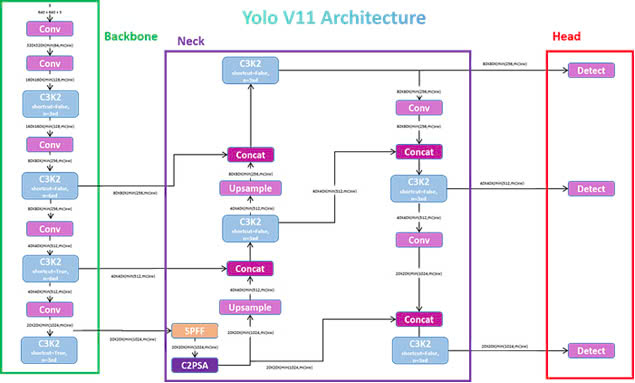

# Nghiên Cứu và Ứng Dụng YOLOv11 trong Đọc Ngày Sản Xuất (MFG/EXP)

## Giới Thiệu

Tôi đã thực hiện một dự án nghiên cứu và ứng dụng mô hình phát hiện đối tượng YOLOv11, tập trung vào việc khám phá kiến trúc, hiệu suất và khả năng huấn luyện của mô hình này. Công việc của tôi bao gồm việc triển khai YOLOv11 trong một ứng dụng thực tế có tên "Manufacturing Date (MFG/EXP) Reading". Trong dự án này, tôi sử dụng YOLOv11 để tự động phát hiện và đọc thông tin ngày sản xuất (MFG) cùng ngày hết hạn (EXP) trên các sản phẩm, nhằm hỗ trợ tối ưu hóa quy trình quản lý kho hàng và kiểm soát chất lượng. Đây là một nỗ lực kết hợp giữa nghiên cứu lý thuyết và áp dụng thực tiễn, thể hiện sự quan tâm của tôi đến lĩnh vực thị giác máy tính và trí tuệ nhân tạo.

## Bối Cảnh

Phát hiện đối tượng là một nhiệm vụ quan trọng trong thị giác máy tính, với ứng dụng từ xe tự hành đến quản lý sản xuất. YOLOv11, phiên bản mới nhất ra mắt năm 2024, mang lại hiệu suất vượt trội trong việc phát hiện đối tượng nhanh và chính xác. Trong dự án "Manufacturing Date (MFG/EXP) Reading", tôi đã áp dụng YOLOv11 để tự động hóa việc đọc ngày tháng trên sản phẩm, hỗ trợ quản lý chuỗi cung ứng và kiểm soát chất lượng.

## Tổng Quan Dự Án

Dự án này bao gồm:

- **Nghiên cứu lý thuyết**: Phân tích kiến trúc, hiệu suất và quá trình huấn luyện của YOLOv11.
- **So sánh phiên bản**: Đánh giá sự cải tiến của YOLOv11 so với YOLOv5.
- **Ứng dụng thực tế**: Sử dụng YOLOv11 trong dự án "Manufacturing Date (MFG/EXP) Reading" để phát hiện và trích xuất thông tin ngày sản xuất/hết hạn từ hình ảnh sản phẩm.

## Ứng Dụng Thực Tế: Manufacturing Date (MFG/EXP) Reading

Trong dự án này, tôi đã:

- **Phát hiện nhãn**: Sử dụng YOLOv11 để xác định vị trí nhãn chứa thông tin MFG/EXP trên sản phẩm.
- **Trích xuất thông tin**: Kết hợp OCR để đọc và giải mã ngày tháng từ hình ảnh.
- **Tự động hóa**: Tối ưu hóa quy trình kiểm tra kho hàng, giảm thiểu sai sót và tăng hiệu suất.

## Kết quả
- **Cấu trúc model:**
 <!--  -->
  

- **UI:**
 <!--  -->
  
  
  
  
  
  

- **UI:**
 <!--  -->
  
  
  
  

## Kết Luận

Nghiên cứu và ứng dụng YOLOv11 vào "Manufacturing Date (MFG/EXP) Reading" không chỉ giúp tôi hiểu sâu hơn về phát hiện đối tượng mà còn thể hiện khả năng áp dụng kiến thức lý thuyết vào thực tiễn. Đây là minh chứng cho kỹ năng nghiên cứu, triển khai giải pháp AI và giải quyết vấn đề thực tế của tôi.

---